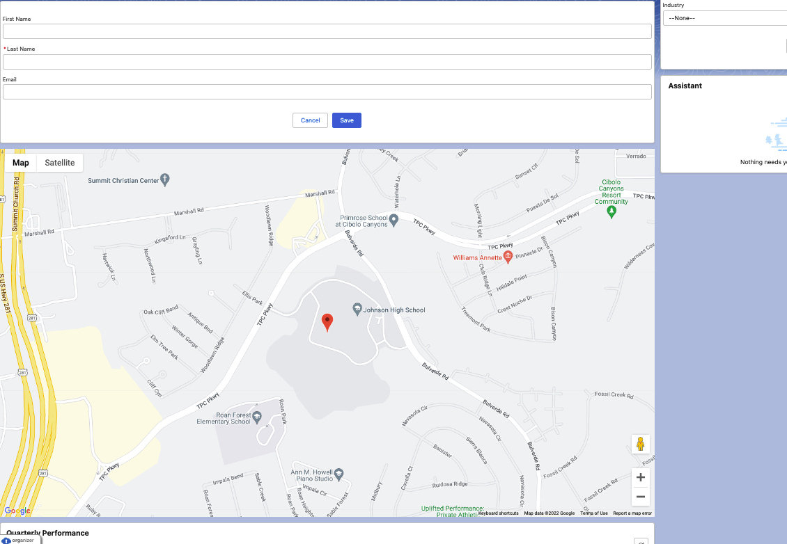

# Aura Component Projects

Aura components are the self-contained and reusable units of an app. They represent a reusable section of the UI, and can range in granularity from a single line of text to an entire app.

<h2>Aura - Map Project:</h2>

 

 
 
   
